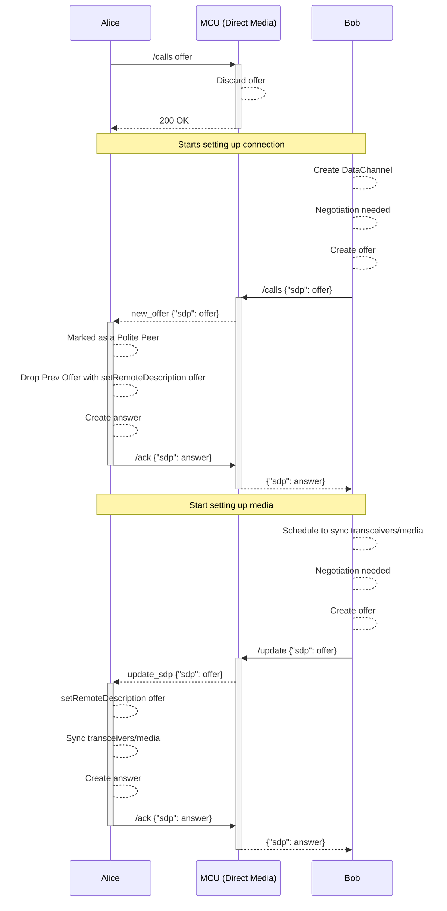
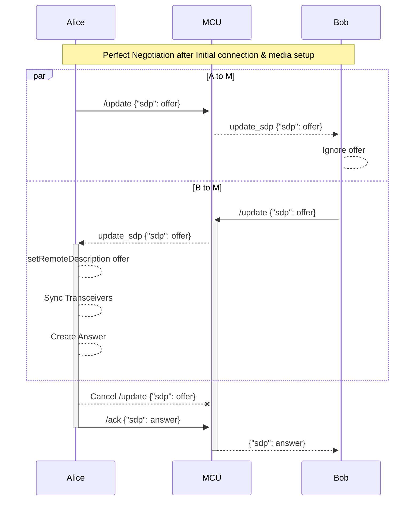
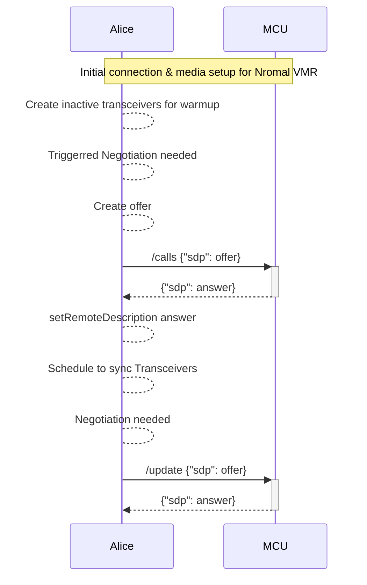

# `@pexip/peer-connection`

Wrapper for `RTCPeerConnection` with `@pexip/signal`

## Install

`npm install @pexip/peer-connection`

## APIs

### Cores

- `PeerConnection`: The general purpose `RTCPeerConnection` wrapper, which can
  be used to create different kind of peer connection with different behavior
  based on needs. See `MainPeerConnection` or `PresentationPeerConnection`.
- `MainPeerConnection`: Logical layer on top of `PeerConnection` to handle media
  connection with the common interface `BasePeerConnection`.
- `PresentationPeerConnection`: Logical layer on top of `PeerConnection` to
  handle presentation media connection with the common interface
  `BasePeerConnection`.

### Utilities

- `createPCSignals`: Create the signals used for `MainPeerConnection` and
  `PresentationPeerConnection` creation.

  Example:

  ```typescript
  // Create all the required signals, and `onConnectionStateChange`
  const mainSignals = createPCSignals('main', ['onConnectionStateChange']);
  ```

### Signals

#### Optional

_Useful when custom implementation of peer connection to handle different
behavior_

- `onConnectionStateChange: Signal<RTCPeerConnectionState>;`:
  `RTCPeerConnection` counterpart `onconnectionstatechange`
- `onDataChannel: Signal<RTCDataChannel>;`: `RTCPeerConnection` counterpart
  `ondatachannel`
- `onIceCandidate: Signal<RTCIceCandidate | null>;`: `RTCPeerConnection`
  counterpart `onicecandidate`, and use this signal for `trickleIce`. If this
  signal is NOT provided, `trickleIce` feature will be disabled.
- `onIceCandidateError: Signal<RTCPeerConnectionIceErrorEvent>;`:
  `RTCPeerConnection` counterpart `onicecandidateerror`.
- `onIceConnectionStateChange: Signal<RTCIceConnectionState>;`:
  `RTCPeerConnection` counterpart `oniceconnectionstatechange`
- `onIceGatheringStateChange: Signal<RTCIceGatheringState>;`:
  `RTCPeerConnection` counterpart `onicegatheringstatechange`
- `onSignalingStateChange: Signal<RTCSignalingState>;`: `RTCPeerConnection`
  counterpart `onsignalingstatechange`
- `onTrack: Signal<RTCTrackEvent>;`: `RTCPeerConnection` counterpart `ontrack`
- `onNegotiationNeeded: Signal<RTCOfferOptions | undefined>;`:
  `RTCPeerConnection` counterpart `onnegotiationneeded`
- `onRemoteStreams: Signal<MediaStream[]>;`: Based on `ontrack` to emit
  `MediaStream[]` when there is one from `RTCPeerConnection['ontrack']`.
- `onRemoteContentStreams: Signal<MediaStream[]>;`: Based on `ontrack` to emit
  `MediaStream[]` when there is one from `RTCPeerConnection['ontrack']`.

The following signals are listened by the peer connection, they can be used for
signal data from remote peer

- `onReceiveIceCandidate: Signal<RTCIceCandidate | RTCIceCandidateInit>;`:
  Signaling counterpart should emit an ICE candidate when the remote peer sends
  an ICE candidate via this signal.

#### Required

The following signals are required to handle for signaling purpose

- `onError: Signal<Error>;`: Emit error when there is error from the peer
  connection
- `onOffer: Signal<RTCSessionDescriptionInit>;`: Emit offer SDP after
  `createOffer`
- `onAnswer: Signal<RTCSessionDescriptionInit>;`: Emit answer SDP after
  `createAnswer`

The following signals are listened by the peer connection, they can be used for
signal data from remote peer

- `onReceiveAnswer: Signal<RTCSessionDescriptionInit>;`: Signaling counterpart
  should emit the answer when the remote peer sends an answer via this signal
- `onReceiveOffer: Signal<RTCSessionDescriptionInit>;`: Signaling counterpart
  should emit an offer when the remote peer sends an offer via this signal
- `onOfferRequired: Signal<MediaStream | undefined>;`: This is an alternative
  way to `setLocalStream` to trigger `RTCPeerConnection['createOffer']`

## Usage

```typescript
// Create a set of required signals to share with the app
// signals.ts
import {createPCSignals} from '@pexip/peer-connection';

// This utility function creates the following signals
//     onOfferRequired: Signal<undefined>;
//     onReceiveAnswer: Signal<RTCSessionDescriptionInit>;
//     onReceiveOffer: Signal<RTCSessionDescriptionInit>;
//     onError: Signal<Error>;
//     onOffer: Signal<RTCSessionDescriptionInit>;
//     onAnswer: Signal<RTCSessionDescriptionInit>;
// and the following from the `more` parameter
//     onRemoteStreams: Signal<MediaStream[]>;
//     onReceiveIceCandidate: Signal<RTCIceCandidate | RTCIceCandidateInit>;
//     onIceCandidate: Signal<RTCIceCandidate | null>;
export const mainSignals = createPCSignals({
  scope: 'main',
  more: ['onRemoteStreams', 'onReceiveIceCandidate', 'onIceCandidate'],
});

// Here are the signal keys and signatures to map `RTCPeerConnection` events
// accordingly you can create any of them to pass in the `PeerConnection` when
// creating the object
//     onConnectionStateChange: Signal<RTCPeerConnectionState>;
//     onDataChannel: Signal<RTCDataChannel>;
//     onIceCandidate: Signal<RTCIceCandidate | null>;
//     onIceCandidateError: Signal<RTCPeerConnectionIceErrorEvent>;
//     onIceConnectionStateChange: Signal<RTCIceConnectionState>;
//     onIceGatheringStateChange: Signal<RTCIceGatheringState>;
//     onSignalingStateChange: Signal<RTCSignalingState>;
//     onTrack: Signal<RTCTrackEvent>;
//     onNegotiationNeeded: Signal<RTCOfferOptions | undefined>;
//     onRemoteStreams: Signal<MediaStream[]>;

// app.ts
import {createMainPeerConnection} from '@pexip/peer-connection';
import {mainSignals} from './signals';

// NOTE: Use `trickleIce` here since we have provided the `onIceCandidate` signal
const mainPeer = createMainPeerConnection(mainSignals, {bandwidth: 1024});

const stream = await navigator.mediaDevices.getUserMedia({
  audio: true,
  video: true,
});

// set local media stream
// Offer will be created based on `negotiationneeded` flag according to the
// spec, and `onOfferSignal` will be emitted afterwards
await mainPeer.setLocalStream(stream);

// Later on to start presentation
const presentationStream = await navigator.mediaDevices.getDisplayMedia();
await peer.setLocalStream(presentationStream, 'slides');

// cleanup
mainPeer.close();

// Change bandwidth, and trigger `RTCPeerConnection['restartIce']` automatically
mainPeer.bandwidth = 2048;

// signaling.ts
// Handle remote peer events
switch (event.type) {
  case 'onIceCandidate':
    mainSignals.onReceiveIceCandidate.emit(event.candidate);
    break;
  case 'onOffer':
    mainSignals.onReceiveOffer.emit(event.offer);
    break;
  case 'onAnswer':
    mainSignals.onReceiveAnswer.emit(event.answer);
    break;
}

// Handle the local peer signals
const subscriptions = [
  mainSignals.onOffer.add(offer => {
    signaling.send({offer});
  }),
  mainSignals.onAnswer.add(answer => {
    signaling.send({answer});
  }),
  mainSignals.onError.add(error => {
    // Something is wrong with the local peer connection
    console.error(error);
  }),
  mainSignals.onRemoteStreams.add([stream] => {
    setStream(stream);
  }),
  mainSignals.onIceCandidate.add(candidate => {
    if (candidate) {
      signaling.send({candidate});
    }
  }),
];
```

## Sequence Diagrams

### Initial connection and media setup for Direct Media



### Perfect Negotiation



### Initial connection and media setup for Normal VMR


